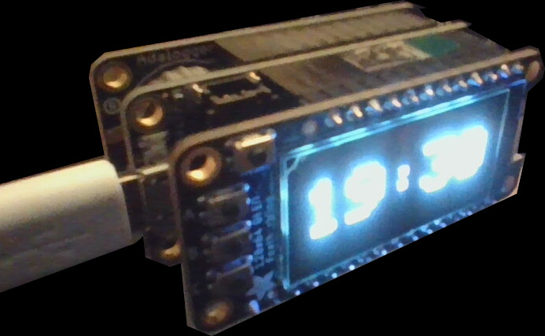

# kidlight

very simple python, cron, shell scripts to turn on different lights at a specific time

## awake.py and asleep.py

both are the same thing basically, but different defaults. Should technically be one script with an argument.

## isthelighton.sh

checks if the scripts are running. If not, runs them in the background according to the correct schedule. 

## cron

put this in your crontab.

side note - raspberry pis are bad at keeping time. Put sntp -S pool.ntp.org in root's cron for every few minutes or something. (or just `timedatectl set-ntp true`)

## clock.ino

I soldered appropriate headers on to the following components and stacked them top to bottom in this order. The program makes them into a clock. I copied a lot of example code to make this work.

- [Adafruit OLED Featherwing display](https://www.adafruit.com/product/4650)
- [Adafruit Feather M0 Express](https://www.adafruit.com/product/3403)
- [Adafruit RTC Featherwing board](https://www.adafruit.com/product/2922)

What I've made is a clock that has a battery-backed RTC. It kinda has to be plugged into a computer to be reset, or you can use buttons A and C to change the time by one minute in either direction. Button B can rotate the display.

Next step is a 3D printed case.